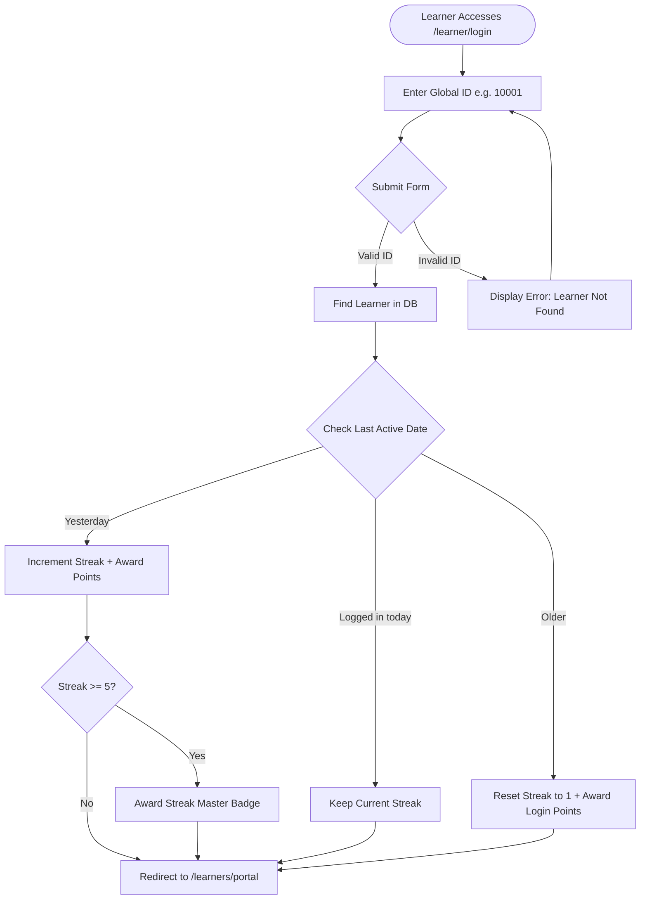
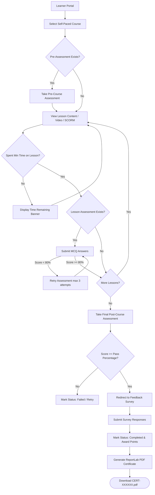
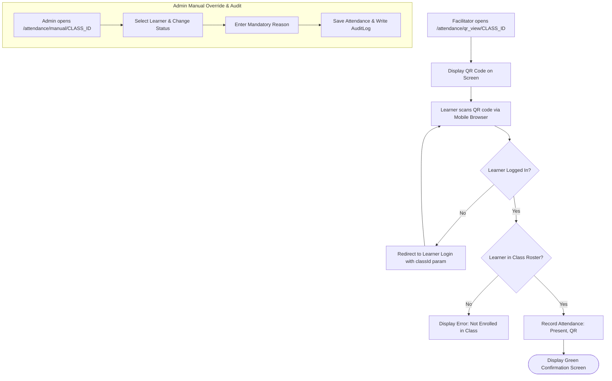
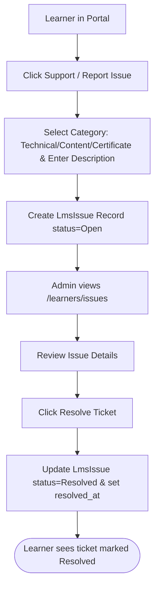

# Learning Hub V3 — User Workflows & Flow Diagrams

This document details the step-by-step workflows for major user journeys in **Learning Hub V3**, including happy paths, alternative paths, and error states.

---

## 1. Learner Authentication & Portal Entry

---

## 2. Self-Paced Course Completion & Certification Flow

---

## 3. Live Class QR Attendance & Audit Override Flow

---

## 4. Support Ticket Resolution Flow

