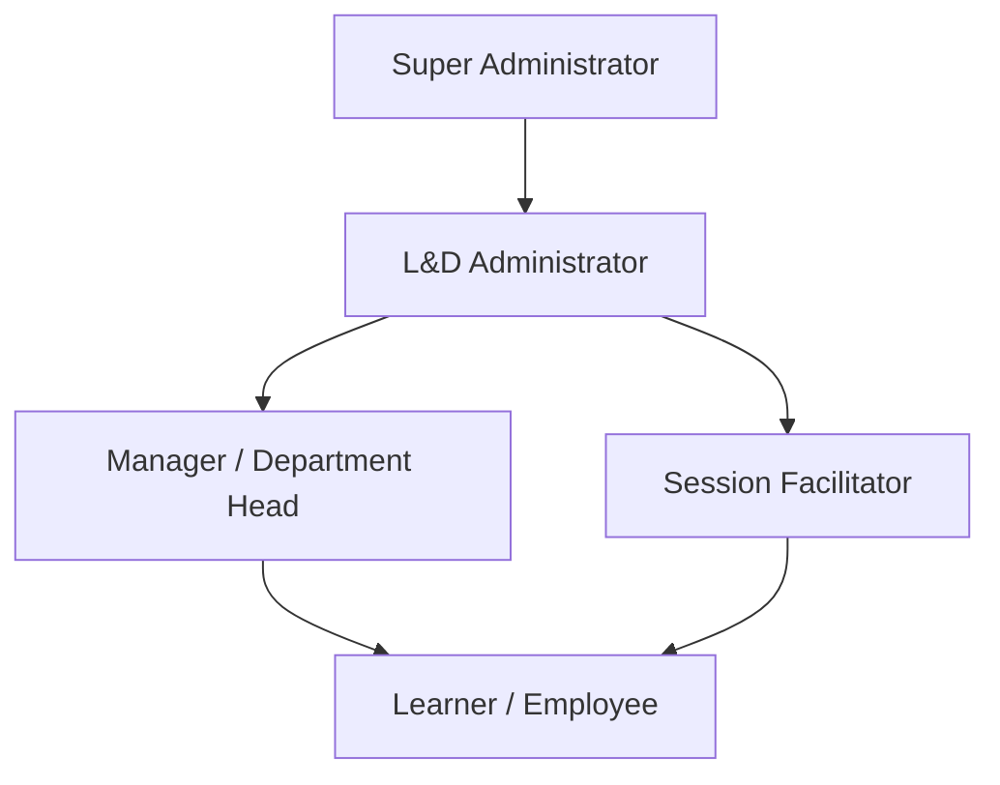

# Learning Hub V3 — User Roles & Permissions

This document details the user roles, access control mechanisms, permission scopes, accessible modules, and restrictions in **Learning Hub V3**.

---

## 1. Role Hierarchy

---

## 2. Detailed Role Definitions

### 2.1 Super Administrator (`admin`)
- **Description**: Top-level system operations administrator responsible for platform infrastructure, storage provider settings, audit compliance, and database maintenance.
- **Authentication**: Form-based authentication (`/login`) with bcrypt/pbkdf2 password hashing.
- **Accessible Modules**:
  - `/super_admin/*` — System backup, database reset, storage provider settings, audit log viewer
  - `/dashboard` — Platform overview analytics
  - All L&D Administrator modules
- **Permissions**:
  - Download SQLite database backups
  - Execute full database reset and re-seeding
  - Inspect system-wide audit logs (`AuditLog`)
  - Configure Backblaze B2 / MinIO S3 credentials
- **Restrictions**: None.

### 2.2 L&D Administrator
- **Description**: Operational manager responsible for curriculum design, courseware authoring, live class scheduling, learner enrollment, attendance override, feedback creation, and compliance report export.
- **Authentication**: Form-based authentication (`/login`).
- **Accessible Modules**:
  - `/courses/*` — Course CRUD, lesson creation, Rise 360 authoring, SCORM upload
  - `/classes/*` — Live class scheduling, facilitator assignment, roster lock/unlock
  - `/learners/*` — Learner directory, Excel import/export, issue ticket management
  - `/attendance/*` — Manual attendance override, attendance reports
  - `/feedback/*` — Survey questionnaire builder, feedback analytics
  - `/certificates/*` — Certificate re-issuance, cert management
  - `/reports/*` — Excel/PDF report generation
  - `/quizzes/*` — Standalone quiz builder
- **Permissions**:
  - Create, update, archive, delete courses and live classes
  - Author Rise 360 interactive block content
  - Manually override attendance with mandatory reason logging
  - Resolve support tickets
- **Restrictions**: Cannot perform system-level database wipes or export DB backups unless logged into Super Admin console.

### 2.3 Session Facilitator
- **Description**: Instructor or subject matter expert assigned to conduct live online or in-person sessions.
- **Authentication**: Passwordless Global ID login (`/learner/login`).
- **Accessible Modules**:
  - `/classes/live/<class_id>` — Live session roster view
  - `/attendance/qr_view/<class_id>` — Facilitator QR code display screen
  - Standard Learner Portal modules
- **Permissions**:
  - Display live class QR code for learner attendance scanning
  - View live class roster and attendance status
- **Restrictions**: Cannot create or archive courses or modify global platform settings.

### 2.4 Manager / Department Head
- **Description**: Organizational manager overseeing direct report learners.
- **Authentication**: Passwordless Global ID login (`/learner/login`).
- **Accessible Modules**:
  - `/learners/portal` — Learner Portal with "My Team" tab
  - Standard Learner Portal modules
- **Permissions**:
  - View progress, course completion rates, and assessment scores of direct reports (`Learner.manager_id == current_user.id`)
  - View and review deadline extension requests from direct reports
- **Restrictions**: Cannot view learners outside their direct reporting hierarchy.

### 2.5 Learner / Employee
- **Description**: End-user taking self-paced or live courses.
- **Authentication**: Passwordless Global ID login (`/learner/login`).
- **Accessible Modules**:
  - `/learners/portal` — Dashboard, active courses, badges, points, streak tracker
  - `/courses/<id>/flow` — Video playback, SCORM execution, PPT slide viewer
  - `/attendance/scan/<class_id>` — Mobile QR attendance camera scanner
  - `/learning_wall/*` — Social wall posts, reactions, comments
  - `/certificates/*` — Earned certificate PDF download
  - `/learners/issues` — Log support ticket
- **Permissions**:
  - Complete enrolled courses and assessments
  - Scan QR code to mark attendance
  - Earn gamification points, streaks, and badges
  - Download earned PDF certificates
  - Post comments and reactions on the Learning Wall
- **Restrictions**: Cannot access administrative views, edit courses, or modify attendance records.
