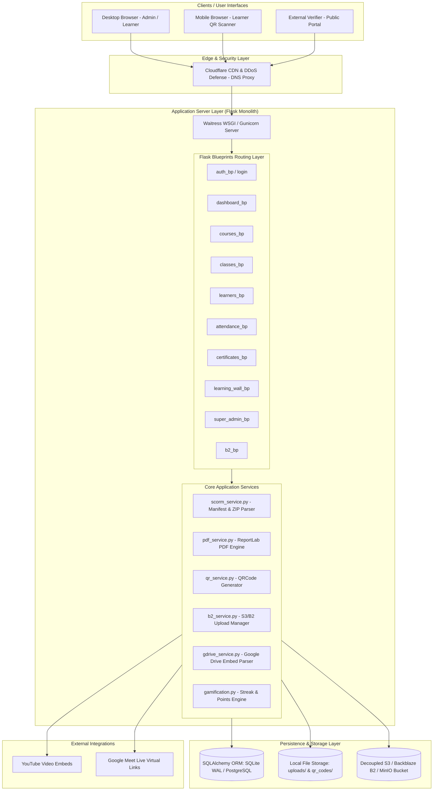

# Learning Hub V3 — System Architecture Document

This document provides the high-level technical architecture of **Learning Hub V3**, detailing the interaction between clients, server application layers, databases, storage engines, and external integrations.

---

## 1. High-Level System Architecture Diagram



---

## 2. Architecture Layer Breakdown

### 2.1 Edge & Security Layer
- **Cloudflare CDN (Optional Production Deployment)**: Proxies inbound HTTPS traffic to hide application server IP, caches static assets (`/static/`), and defends against distributed denial-of-service (DDoS) attacks.

### 2.2 Application Server Layer
- **WSGI Runner**: Runs on Waitress (Production Windows/Linux) or Gunicorn (Linux/Render) listening on configurable port (default 5000).
- **Flask Framework (3.1.3)**: Handles request lifecycle, session management, CSRF validation, and template rendering.
- **13 Modular Blueprints**: Organizes routing by feature module.

### 2.3 Core Services Subsystem
- **SCORM Engine (`scorm_service.py`)**: Handles unzipping SCORM zip packages, extracting `imsmanifest.xml`, resolving root launch HTML files, and serving isolated asset streams.
- **PDF Engine (`pdf_service.py`)**: Uses `reportlab` to programmatically build vector PDF certificates with custom typography, borders, logos, and QR codes.
- **QR Engine (`qr_service.py`)**: Generates PNG QR code images encoding URL routes for instantaneous mobile attendance scanning.
- **Storage Subsystem (`b2_service.py`, `storage_service.py`)**: Dual-mode storage engine. Automatically toggles between local filesystem (`uploads/`) and S3-compatible cloud storage (Backblaze B2 / MinIO) using `boto3`.

### 2.4 Persistence Subsystem
- **SQLAlchemy 2.0 ORM**: Abstracts SQL database queries.
- **Database Backends**:
  - **SQLite (`lms.db`)**: Pre-configured for local dev and lightweight deployment with `PRAGMA journal_mode=WAL` and `PRAGMA synchronous=NORMAL`.
  - **PostgreSQL (`DATABASE_URL`)**: Configured via environment variable for production scale (60,000+ active learners).

---

## 3. Data Flow Architecture

### 3.1 Courseware Playback Data Flow
```
Learner Request → Course BP → Fetch CourseLesson & LessonCourseware → Check Type:
  ├── Video URL → Render HTML5 iframe (YouTube / direct stream)
  ├── PDF / PPT → Parse via pypdfium2 / pptx_parser → Render embedded canvas / slides
  └── SCORM → Extract ZIP via scorm_service → Launch index.html inside iframe
```

### 3.2 Certificate Issuance Data Flow
```
Course Completed & Feedback Submitted → Trigger generate_certificate() →
  ├── Generate Unique CERT-UUID ID
  ├── Invoke pdf_service.py ReportLab canvas
  ├── Draw text, borders, verification URL, QR code
  ├── Output PDF file to uploads/certificates/
  └── Save Certificate record in Database
```
