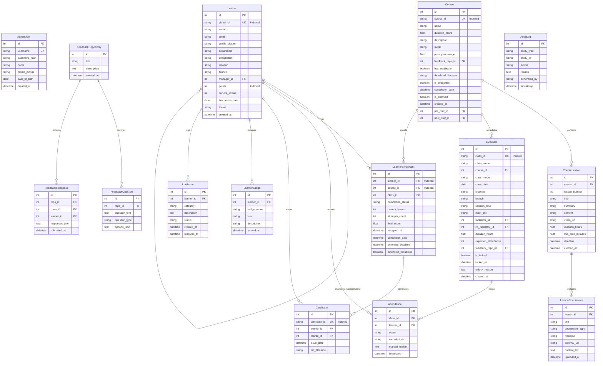

# Learning Hub V3 — Entity Relationship (ER) Diagram

This document renders the complete Entity-Relationship diagram for **Learning Hub V3** using Mermaid ER notation.

---

```mermaid
erDiagram
    AdminUser {
        int id PK
        string username UK
        string password_hash
        string name
        string profile_picture
        date date_of_birth
        datetime created_at
    }

    Learner {
        int id PK
        string global_id UK "Indexed"
        string name
        string email
        string profile_picture
        string department
        string designation
        string location
        string branch
        int manager_id FK
        int points "Indexed"
        int current_streak
        date last_active_date
        string theme
        datetime created_at
    }

    Course {
        int id PK
        string course_id UK "Indexed"
        string name
        float duration_hours
        string description
        string mode
        float pass_percentage
        int feedback_repo_id FK
        boolean has_certificate
        string thumbnail_filename
        boolean is_sequential
        datetime completion_date
        boolean is_archived
        datetime created_at
        int pre_quiz_id FK
        int post_quiz_id FK
    }

    CourseLesson {
        int id PK
        int course_id FK
        int lesson_number
        string title
        string summary
        string content
        string video_url
        float duration_hours
        float min_time_minutes
        datetime deadline
        datetime created_at
    }

    LessonCourseware {
        int id PK
        int lesson_id FK
        string title
        string courseware_type
        string filename
        string external_url
        text content_text
        datetime uploaded_at
    }

    LiveClass {
        int id PK
        string class_id UK "Indexed"
        string class_name
        int course_id FK
        string class_mode
        date class_date
        string location
        string branch
        string session_time
        string meet_link
        int facilitator_id FK
        int co_facilitator_id FK
        float duration_hours
        int expected_attendance
        int feedback_repo_id FK
        boolean is_locked
        datetime locked_at
        text unlock_reason
        datetime created_at
    }

    LearnerEnrollment {
        int id PK
        int learner_id FK "Indexed"
        int course_id FK "Indexed"
        int class_id FK
        string completion_status
        int current_lesson
        int attempts_count
        float final_score
        datetime assigned_at
        datetime completion_date
        datetime extended_deadline
        boolean extension_requested
    }

    Attendance {
        int id PK
        int class_id FK
        int learner_id FK
        string status
        string recorded_via
        text manual_reason
        datetime timestamp
    }

    Certificate {
        int id PK
        string certificate_id UK "Indexed"
        int learner_id FK
        int course_id FK
        datetime issue_date
        string pdf_filename
    }

    FeedbackRepository {
        int id PK
        string title
        text description
        datetime created_at
    }

    FeedbackQuestion {
        int id PK
        int repo_id FK
        text question_text
        string question_type
        text options_json
    }

    FeedbackResponse {
        int id PK
        int repo_id FK
        int class_id FK
        int learner_id FK
        text responses_json
        datetime submitted_at
    }

    LearnerBadge {
        int id PK
        int learner_id FK
        string badge_name
        string icon
        string description
        datetime earned_at
    }

    LmsIssue {
        int id PK
        int learner_id FK
        string category
        text description
        string status
        datetime created_at
        datetime resolved_at
    }

    AuditLog {
        int id PK
        string entity_type
        string entity_id
        string action
        text reason
        string performed_by
        datetime timestamp
    }

    Learner ||--o{ Learner : "manages (subordinates)"
    Learner ||--o{ LearnerEnrollment : "has"
    Learner ||--o{ Attendance : "records"
    Learner ||--o{ Certificate : "earns"
    Learner ||--o{ LearnerBadge : "receives"
    Learner ||--o{ LmsIssue : "logs"
    Course ||--o{ CourseLesson : "contains"
    Course ||--o{ LiveClass : "schedules"
    Course ||--o{ LearnerEnrollment : "enrolls"
    CourseLesson ||--o{ LessonCourseware : "includes"
    LiveClass ||--o{ Attendance : "tracks"
    LearnerEnrollment ||--o{ Certificate : "generates"
    FeedbackRepository ||--o{ FeedbackQuestion : "defines"
    FeedbackRepository ||--o{ FeedbackResponse : "collects"
```
