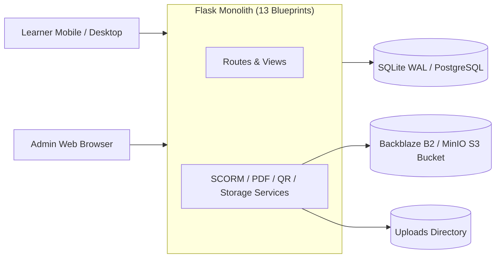

# AS-BUILT PRODUCT DOCUMENTATION — LEARNING HUB V3

## Executive Summary: "What Exactly Did We Build?"

**Learning Hub V3** is an enterprise Learning & Development (L&D) platform engineered to manage, deliver, track, and certify corporate and academic training programs. Built to scale to 60,000+ active learners, the product unifies self-paced digital courseware, live online sessions, and campus-based in-person workshops into a single responsive web system.

---

## 1. Vision Comparison: Intended vs. Actually Implemented

| Domain | Reconstructed Intended Vision | Actually Implemented System | Status / Gap |
| :--- | :--- | :--- | :--- |
| **Learner Authentication** | Enterprise Single Sign-On (SSO / Google OAuth2) | Passwordless Global ID login (`/learner/login`) | **Gap**: Password verification not implemented; passwordless lookup. |
| **Multi-Mode Courses** | Self-Paced, Live Online, Live In-Person | Fully supported with distinct course ID prefixes (`CRS-SP-`, `CRS-ON-`, `CRS-IP-`) | **Fully Implemented** |
| **Attendance Verification** | Real-time QR scanning & manual audit | Mobile camera QR scan endpoint and manual override with mandatory reason logging | **Fully Implemented** |
| **Courseware Authoring** | Video, PDF, SCORM, Rise 360 block builder | Integrated SCORM player, pypdfium2 PDF parser, pptx renderer, and Rise 360 versioned block builder | **Fully Implemented** |
| **Certification** | Automated verifiable PDF certificates | Instant ReportLab PDF generation with unique `CERT-UUID` and public verification portal (`/certificates/verify`) | **Fully Implemented** |
| **Scalable Storage** | Decoupled S3 / Backblaze B2 / MinIO storage | `b2_service.py` with `boto3` AWS S3 compatibility for low-cost media delivery | **Fully Implemented** |
| **Automated Testing** | Comprehensive CI/CD test regression suite | 0 automated unit/integration test files found | **Gap**: 0% test coverage. |

---

## 2. Final System Architecture Summary

---

## 3. Final Feature Matrix Summary

- **Total Implemented Features**: 20 Core Feature Modules
- **Total API Routes**: 40 Endpoints across 13 Blueprints
- **Total Database Models**: 14 Relational Models (29 SQL Tables)
- **Primary Tech Stack**: Python 3.14, Flask 3.1.3, SQLAlchemy 2.0, Jinja2, Bootstrap 5, Waitress WSGI, ReportLab, pypdfium2, boto3.

---

## 4. Key Recommendations for Future Maintenance

1. **Implement Learner Password / SSO Security**: Replace passwordless Global ID login with Google OAuth2 or bcrypt password validation.
2. **Build Automated Test Suite**: Implement `pytest` suite for core services to ensure zero regression failures.
3. **Refactor Route Controllers**: Split `courses.py` (100 KB) and `learners.py` (70 KB) into modular service controllers.
