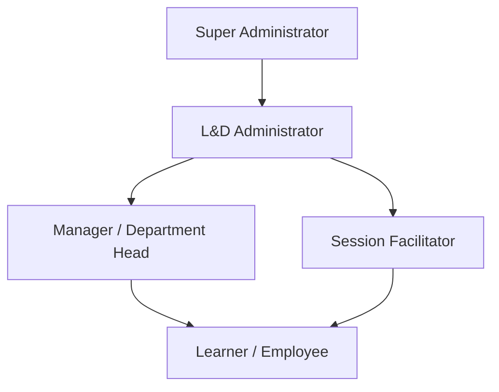
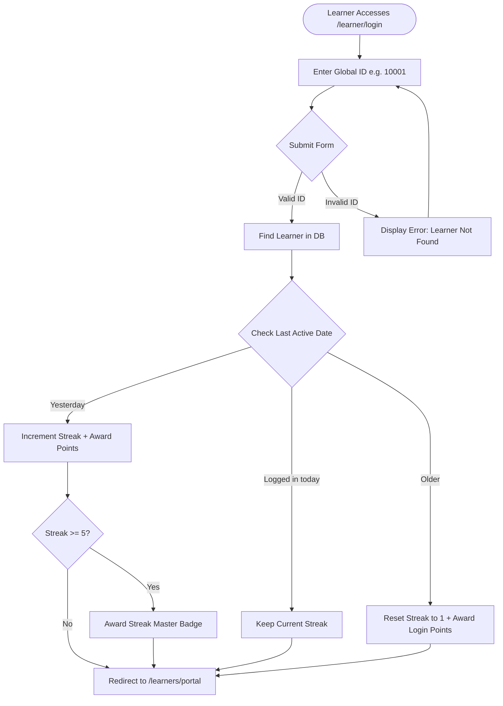
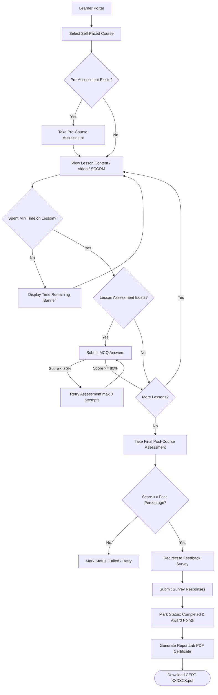
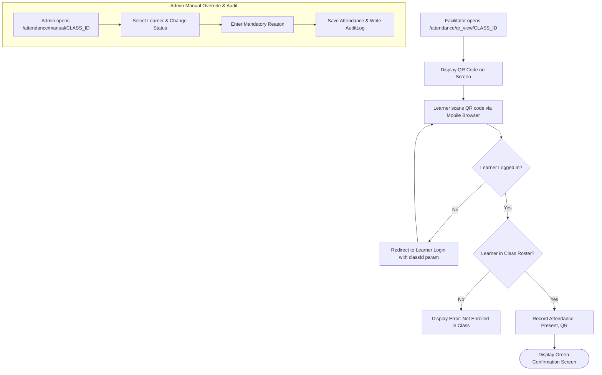
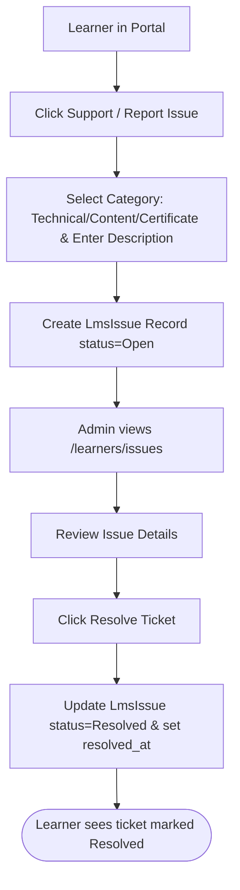

# LEARNING HUB V3 — INITIAL PRODUCT CONCEPT & POC DOCUMENTATION

> **Document Type**: Proof of Concept (POC) & Initial Product Vision Documentation

> **Status**: Reconstructed from System Implementation

---


<!-- Product_Vision.md -->

# Learning Hub V3 — Product Vision & Concept Documentation

> [!IMPORTANT]
> **RECONSTRUCTED FROM IMPLEMENTATION**: Original requirement documents were not present in the repository. The vision, problem statement, scope, and target user profiles contained in this document have been factually reconstructed based strictly on the implemented codebase and application behavior.

---

## 1. Reconstructed Product Vision

**Learning Hub V3** is an enterprise Learning & Development (L&D) platform engineered to manage, deliver, and track corporate and academic training programs for large organizations (designed to scale up to 60,000+ active learners). 

The product bridges self-paced digital learning (video content, SCORM packages, interactive Rise 360 block modules, PPTX slides) with structured live classroom training (in-person campus workshops and online virtual sessions via Google Meet). It combines real-time attendance tracking (QR code scanning), automated certificate issuance, gamified engagement (points, badges, streak tracking), social community interaction (Learning Wall), and administrative operations (roster management, feedback surveys, helpdesk support ticketing).

---

## 2. Problem Statement

Large educational and enterprise institutions face critical challenges in operationalizing staff and faculty development:
1. **Fragmented Learning Delivery**: Inability to manage self-paced digital modules alongside physical campus workshops in a single platform.
2. **Attendance & Verification Overhead**: Manual paper-based attendance tracking for live sessions creates data entry delays, ghost attendance, and audit failures.
3. **Engagement Drop-off**: Lack of interactive feedback loops, gamification incentives, and peer recognition leads to low course completion rates.
4. **Infrastructure Bottlenecks**: Traditional monolithic LMS platforms incur exorbitant storage and egress bandwidth costs when streaming high-definition video and interactive materials to tens of thousands of simultaneous learners.

---

## 3. Target Users

Based on codebase models and database initializations (`app/seed.py`), the target audience comprises:
1. **L&D Administrators & Academic Directors**: Operational leaders managing curriculum, scheduling live classes, monitoring completion compliance, and generating audit reports.
2. **Learners / Faculty Members / Staff**: Enterprise employees (e.g. Lecturers, Professors, Instructional Designers, Managers across academic departments like Mathematics, Physics, Chemistry, CS, Engineering) taking self-paced or mandatory live training.
3. **Session Facilitators / Instructors**: Trainers conducting live online or campus sessions who need to track live attendance and collect session feedback.
4. **People Managers / Department Heads**: Managers monitoring direct reports' course progress and compliance matrices.
5. **System Administrators / DevOps Engineers**: System maintainers managing platform health, database migration, storage decoupling, and backups.

---

## 4. Business Objective

- **Standardize L&D Operations**: Centralize training administration across multiple geographical campuses (e.g., Hyderabad, Bangalore, Chennai, Pune) and local branches.
- **Cost-Optimized Scale**: Support 60,000+ active learners using low-cost cloud architecture (decoupled MinIO / Backblaze B2 storage, SQLite WAL mode / PostgreSQL, Cloudflare CDN).
- **Automate Compliance & Certification**: Seamlessly issue verifiable PDF certificates upon passing required post-assessments and feedback surveys.

---

## 5. Product Scope

### In-Scope (Implemented Features)
- **Multi-Mode Learning Management**: Self-Paced digital courses, Live Online classes (Google Meet links), and Live In-Person campus sessions.
- **Rich Courseware Support**: Embedded YouTube videos, non-downloadable materials, SCORM package player, PPTX slide rendering, and Rise 360 interactive block content.
- **Real-Time Attendance Engine**: Dual-mode attendance via automated QR code scanning (facilitator view / learner scan) and manual admin override with audit logging.
- **Assessment & Quiz Engine**: Pre-assessments, lesson post-assessments, course-end assessments, and standalone quizzes with configurable pass thresholds (default 80%).
- **Gamification & Social Engagement**: Daily login streak tracking, point accrual, badge distribution (`Streak Master 🔥`, `Fast Learner`), and interactive social Learning Wall (reactions, comments, birthday notices).
- **Feedback & Support**: Flexible feedback questionnaire repositories, session survey submission, and integrated L&D support ticket system.
- **Decoupled Object Storage**: Configurable local storage fallback or S3-compatible cloud storage (Backblaze B2 / MinIO).
- **Super Admin Operations**: System backup/restore, audit trail logging, and database resets.

### Out of Scope (Not Available / Cannot Be Determined)
- E-commerce / Course Monetization / Payment Gateway Integration
- Real-time video conferencing hosting built into the platform (relies on external links like Google Meet)
- Enterprise Single Sign-On (SSO / SAML 2.0 / OAuth2) — *Learner login currently uses passwordless Global ID; Google SSO commented in code as future phase*.
- Mobile Native Apps (iOS/Android) — *Platform is built as a responsive web app*.

---

## 6. User Roles Summary

| Role Name | Access Scope | Key Responsibilities |
| :--- | :--- | :--- |
| **Super Administrator** | Platform Management | Storage provider configuration, DB backups, audit trail inspection, database resets. |
| **L&D Administrator** | Full LMS Admin | Course creation, live class scheduling, roster management, quiz setup, report export. |
| **Learner** | Learner Portal | Course consumption, assessment submission, QR attendance scan, badge/cert collection. |
| **Facilitator** | Class Management | Class roster management, QR code seating display, live attendance marking. |
| **Manager** | Team Tracking | Views progress, completion rates, and extension requests of direct subordinates. |

---

## 7. High-Level User Journeys

### Journey 1: Learner Self-Paced Training Flow
```
Learner Login (Global ID) → Learner Portal → Select Self-Paced Course → Watch Video / View Courseware → Take Lesson Assessment → Pass Assessment (≥80%) → Complete Feedback Survey → Generate & Download PDF Certificate
```

### Journey 2: Live In-Person Class & QR Attendance Flow
```
Admin Schedules Live Class → Learner Enrolls → Facilitator Displays Class QR Code → Learner Scans QR Code via Mobile → Attendance Marked 'Present' → Facilitator Locks Class Roster
```

---

## 8. Success Criteria

1. **Zero-Downtime Multi-Mode Delivery**: Reliable streaming of learning materials across high-concurrency periods.
2. **Attendance Verification Speed**: QR scanning speed under 2 seconds per learner.
3. **Automated Certificate Delivery**: Instant PDF rendering upon passing post-assessment and feedback submission.
4. **Data Integrity**: Complete audit trail logging for manual attendance overrides and roster unlocks.


---


<!-- SRS.md -->

# Learning Hub V3 — Software Requirements Specification (SRS)

## 1. Introduction

### 1.1 Purpose
This Software Requirements Specification (SRS) document defines the functional and non-functional requirements of **Learning Hub V3**, based strictly on the current implemented codebase.

### 1.2 Scope
Learning Hub V3 is an enterprise Learning & Development management web application designed for corporate and educational organizations. It supports multi-mode course delivery (Self-Paced, Live Online, Live In-Person), QR-code based live session attendance, interactive quizzes, automated PDF certificate generation, Rise 360 block content authoring, SCORM package execution, gamified engagement, social learning wall interactions, and administrative report exports.

### 1.3 Definitions and Terminology
- **Global ID**: Unique learner identification string (e.g. `10001`) used for passwordless login and corporate roster mapping.
- **Rise 360 Block**: Modular courseware JSON content schema allowing interactive accordion, flipcard, process, and quiz blocks.
- **SCORM**: Sharable Content Object Reference Model standard package (`.zip`) parsed and served by the platform.
- **WAL Mode**: Write-Ahead Logging database mode configured in SQLite for high-concurrency read/write operations.

---

## 2. System Overview

Learning Hub V3 follows a modular Flask architecture:
- **Presentation Layer**: Responsive HTML5 templates rendered server-side via Jinja2, styled with vanilla CSS, custom theme skins, and Bootstrap 5.
- **Application Layer**: 13 domain-specific Flask Blueprints managing business logic, routing, authentication, and file processing.
- **Persistence & Storage Layer**: SQLAlchemy ORM backing SQLite (`lms.db`) or PostgreSQL (`DATABASE_URL`), with hybrid local/S3-compatible object storage.

---

## 3. User Roles & Access Control Matrix

| Role | Role Description | Accessible Modules | Key Restrictions |
| :--- | :--- | :--- | :--- |
| **Super Administrator** | Platform DevOps & DB Maintenance | `/super_admin`, `/dashboard`, all admin modules | Full unrestricted system access |
| **L&D Administrator** | Curriculum & Operations Manager | `/courses`, `/classes`, `/learners`, `/attendance`, `/feedback`, `/certificates`, `/reports`, `/quizzes` | Cannot modify system-level S3 configs or trigger DB wipes unless in super admin |
| **Learner** | Student / Employee | `/learners/portal`, `/learning_wall`, `/certificates/verify`, course flows | Cannot access admin interfaces or view other learners' private reports |
| **Facilitator** | Session Instructor | Live class roster view, QR seating display, attendance marking | Access limited to assigned live classes |
| **Manager** | Subordinate Manager | Learner portal team tab | Can only view direct reports (`manager_id` foreign key) |

---

## 4. Functional Requirements

### FR-001: Admin Authentication
- **Description**: L&D Administrators authenticate via username and password.
- **Actor**: L&D Administrator
- **Preconditions**: User navigates to `/login`.
- **Main Flow**: Admin inputs username/password → system verifies hash with `AdminUser.password_hash` → session variable `admin_logged_in=True` set → redirect to `/dashboard`.
- **Validation**: Username and password required.
- **Error Conditions**: Invalid credentials display error banner "Invalid Username or Password".
- **Implementation Status**: **Fully Implemented**

### FR-002: Passwordless Learner Authentication
- **Description**: Learners log in using their Global ID without requiring a password.
- **Actor**: Learner
- **Preconditions**: Learner navigates to `/learner/login`.
- **Main Flow**: Learner submits Global ID → system matches `Learner.global_id` → updates login streak and awards daily points → sets `session['learner_id']` → redirects to `/learners/portal`.
- **Validation**: Global ID string required.
- **Error Conditions**: Non-existent Global ID returns "Learner with Global ID X not found".
- **Implementation Status**: **Fully Implemented** (Security weakness: passwordless).

### FR-003: Course Creation & Management
- **Description**: Admins create, edit, archive, and delete courses.
- **Actor**: L&D Administrator
- **Preconditions**: Admin is logged in.
- **Main Flow**: Admin accesses `/courses/create` → fills details (Title, Duration, Mode: Self Paced / Live Online / Live In Person, Pass Percentage, Thumbnail) → system auto-generates ID (`CRS-SP-001`, `CRS-ON-001`, `CRS-IP-001`) → saves `Course` record.
- **Validation**: Pass percentage 0-100%, required title and mode.
- **Implementation Status**: **Fully Implemented**

### FR-004: Course Lesson & Courseware Management
- **Description**: Admins add lessons and attach multi-format courseware (Video URL, PDF, PPT, Text, SCORM, Google Drive).
- **Actor**: L&D Administrator
- **Preconditions**: Course exists.
- **Main Flow**: Admin selects course → adds lesson (number, title, min_time_minutes) → uploads file or enters external URL → saves `LessonCourseware`.
- **Implementation Status**: **Fully Implemented**

### FR-005: Interactive Rise 360 Courseware Authoring
- **Description**: Admins author interactive block-based courseware versioned in JSON.
- **Actor**: L&D Administrator
- **Preconditions**: `ENABLE_CONTENT_AUTHORING=True` in environment.
- **Main Flow**: Admin accesses Rise editor for courseware → adds text, accordion, flipcard, process, or quiz blocks → saves version to `RiseCoursewareVersion` → publishes.
- **Implementation Status**: **Fully Implemented**

### FR-006: SCORM Package Upload & Execution
- **Description**: Admins upload SCORM `.zip` packages; learners execute them via an embedded iframe.
- **Actor**: Admin / Learner
- **Preconditions**: SCORM zip package uploaded.
- **Main Flow**: Admin uploads SCORM zip → `scorm_service.py` extracts manifest `imsmanifest.xml` → finds launch HTML → learner launches courseware → iframe renders package.
- **Implementation Status**: **Fully Implemented**

### FR-007: Live Class Scheduling & Roster Management
- **Description**: Admins schedule live classes linked to courses with facilitators and rosters.
- **Actor**: L&D Administrator
- **Preconditions**: Course and Facilitator learner exist.
- **Main Flow**: Admin navigates to `/classes/create` → selects course, mode (In Person/Online), date, location/meet_link, facilitator → system generates `CRS-CLS-XXXXXX` → admin enrolls learners.
- **Implementation Status**: **Fully Implemented**

### FR-008: Real-Time QR Code Attendance
- **Description**: Facilitators display a class QR code; learners scan to mark attendance.
- **Actor**: Facilitator / Learner
- **Preconditions**: Live class active; learner logged in on mobile.
- **Main Flow**: Facilitator opens QR seating view → Learner scans QR URL `/attendance/scan/<class_id>` → system records `Attendance(status='Present', recorded_via='QR')`.
- **Implementation Status**: **Fully Implemented**

### FR-009: Manual Attendance Override & Audit Logging
- **Description**: Admins manually update learner attendance status with mandatory reason logging.
- **Actor**: L&D Administrator
- **Preconditions**: Live class roster displayed.
- **Main Flow**: Admin changes status to Present/Absent/Late → submits mandatory justification reason → system updates `Attendance` and creates `AuditLog` entry.
- **Implementation Status**: **Fully Implemented**

### FR-010: Assessment & Quiz Engine
- **Description**: System delivers Pre, Post, and Lesson MCQ assessments and calculates pass percentage.
- **Actor**: Learner
- **Preconditions**: Learner enrolled in course.
- **Main Flow**: Learner submits assessment answers → system evaluates correct options → computes percentage → records `AssessmentAttempt` → if score ≥ `course.pass_percentage`, marks passed.
- **Implementation Status**: **Fully Implemented**

### FR-011: Automated PDF Certificate Generation
- **Description**: System generates verifiable PDF certificates upon course completion and feedback submission.
- **Actor**: System / Learner
- **Preconditions**: Course completed and feedback submitted.
- **Main Flow**: System checks eligibility → invokes `pdf_service.py` using ReportLab → generates PDF file `CERT-XXXXXX.pdf` → saves `Certificate` record → learner downloads.
- **Implementation Status**: **Fully Implemented**

### FR-012: Certificate Verification Portal
- **Description**: Public endpoint to verify certificate authenticity by Certificate ID.
- **Actor**: Public / Employer
- **Preconditions**: Certificate ID provided.
- **Main Flow**: User visits `/certificates/verify?id=CERT-XXXXXX` → system queries database → displays learner name, course title, and issue date.
- **Implementation Status**: **Fully Implemented**

### FR-013: Feedback Survey Repository & Submission
- **Description**: Admins build reusable feedback questionnaires; learners complete surveys after classes/courses.
- **Actor**: Admin / Learner
- **Preconditions**: Feedback repository attached to course/class.
- **Main Flow**: Learner completes course → redirected to feedback survey → submits responses → saved as JSON in `FeedbackResponse`.
- **Implementation Status**: **Fully Implemented**

### FR-014: Gamification Engine (Streaks, Points, Badges)
- **Description**: System tracks daily login streaks, awards points for activities, and grants badges.
- **Actor**: Learner / System
- **Preconditions**: Learner logs in or completes action.
- **Main Flow**: Learner logs in on consecutive days → streak increments → points awarded via `award_points()` → badge awarded via `award_badge()` when criteria met (e.g. 5-day streak).
- **Implementation Status**: **Fully Implemented**

### FR-015: Social Learning Wall
- **Description**: Interactive wall for announcements, birthday wishes, course completion posts, reactions, and comments.
- **Actor**: Learner / Admin
- **Preconditions**: User logged in.
- **Main Flow**: System or user creates post (`LearningWallPost`) → users add reactions (`like`, `love`, `celebrate`, `clap`, `fire`) or submit text comments.
- **Implementation Status**: **Fully Implemented**

### FR-016: Support Ticket Management
- **Description**: Learners log support tickets; admins review and resolve them.
- **Actor**: Learner / Admin
- **Preconditions**: Learner logged in.
- **Main Flow**: Learner submits issue description & category → `LmsIssue` created (`Open`) → Admin reviews in `/learners/issues` → marks `Resolved`.
- **Implementation Status**: **Fully Implemented**

### FR-017: Learner Bulk Import & Export
- **Description**: Admins import learners via Excel/CSV and export learner directories.
- **Actor**: L&D Administrator
- **Preconditions**: Valid Excel file uploaded.
- **Main Flow**: Admin uploads Excel file → pandas parses rows → validates Global IDs → creates/updates `Learner` records.
- **Implementation Status**: **Fully Implemented**

### FR-018: Manager Team Roster View
- **Description**: Managers view progress of direct reports.
- **Actor**: Manager Learner
- **Preconditions**: Learner has subordinates (`Learner.manager_id` points to learner ID).
- **Main Flow**: Manager accesses "My Team" tab in portal → system queries `Learner.query.filter_by(manager_id=...)` → renders team completion statistics.
- **Implementation Status**: **Fully Implemented**

### FR-019: Decoupled Backblaze B2 / MinIO Storage Integration
- **Description**: Storage service delegates file storage to S3 API endpoints when configured.
- **Actor**: System
- **Preconditions**: `STORAGE_PROVIDER=s3` set in environment.
- **Main Flow**: Upload requested → `b2_service.py` uploads byte stream via `boto3` to S3 bucket → generates direct/presigned S3 URL.
- **Implementation Status**: **Fully Implemented**

### FR-020: Super Admin Backup, Restore & Reset
- **Description**: Super admin exports database backup, restores DB, or resets data cleanly.
- **Actor**: Super Administrator
- **Preconditions**: Logged in as super admin.
- **Main Flow**: Super admin selects Backup Database → system copies `lms.db` to downloadable archive; select Reset → system re-executes `init_db_and_seed`.
- **Implementation Status**: **Fully Implemented**

---

## 5. Non-Functional Requirements

### 5.1 Performance
- **Database Indexing**: Explicit database indexes on `Learner.global_id`, `Course.course_id`, `LiveClass.class_id`, `Certificate.certificate_id`, `LearnerEnrollment.learner_id`, `LearnerEnrollment.course_id`.
- **SQLite Concurrency**: Configured WAL mode (`PRAGMA journal_mode=WAL`) and normal synchronous mode (`PRAGMA synchronous=NORMAL`) to support concurrent reader threads.
- **File Payload Limit**: Maximum HTTP payload upload size capped at 1 GB (`MAX_CONTENT_LENGTH = 1024 * 1024 * 1024`).

### 5.2 Security
- **Admin Password Protection**: Admin passwords hashed using PBKDF2/SHA256 via Werkzeug (`generate_password_hash`).
- **CSRF Protection**: Universal CSRF protection enabled via Flask-WTF (`CSRFProtect`), with explicit exemption for B2 storage routes.
- **Security Vulnerabilities Identified**: Learner authentication lacks password verification (passwordless Global ID). Hardcoded default admin credentials in seed script.

### 5.3 Reliability & Availability
- **WSGI Production Support**: Production deployment configured with Waitress WSGI server (`waitress.serve`) on Windows/Linux and Gunicorn on Render (`Procfile`).
- **Fallback Storage**: Automatic local storage fallback (`uploads/`) if S3/MinIO cloud storage credentials are not provided.

### 5.4 Maintainability & Extensibility
- **Modular Blueprints**: Clean separation of concerns across 13 Flask Blueprints.
- **Alembic Migrations**: Relational database migration support enabled via Flask-Migrate.

### 5.5 Usability
- **Dynamic Styling & Themes**: Theme engine supporting custom skins (`navy`, etc.) persisted per learner session.
- **Responsive Layout**: Bootstrap 5 responsive layout compatible with mobile browsers for QR attendance scanning.


---


<!-- User_Roles.md -->

# Learning Hub V3 — User Roles & Permissions

This document details the user roles, access control mechanisms, permission scopes, accessible modules, and restrictions in **Learning Hub V3**.

---

## 1. Role Hierarchy



---

## 2. Detailed Role Definitions

### 2.1 Super Administrator (`admin`)
- **Description**: Top-level system operations administrator responsible for platform infrastructure, storage provider settings, audit compliance, and database maintenance.
- **Authentication**: Form-based authentication (`/login`) with bcrypt/pbkdf2 password hashing.
- **Accessible Modules**:
  - `/super_admin/*` — System backup, database reset, storage provider settings, audit log viewer
  - `/dashboard` — Platform overview analytics
  - All L&D Administrator modules
- **Permissions**:
  - Download SQLite database backups
  - Execute full database reset and re-seeding
  - Inspect system-wide audit logs (`AuditLog`)
  - Configure Backblaze B2 / MinIO S3 credentials
- **Restrictions**: None.

### 2.2 L&D Administrator
- **Description**: Operational manager responsible for curriculum design, courseware authoring, live class scheduling, learner enrollment, attendance override, feedback creation, and compliance report export.
- **Authentication**: Form-based authentication (`/login`).
- **Accessible Modules**:
  - `/courses/*` — Course CRUD, lesson creation, Rise 360 authoring, SCORM upload
  - `/classes/*` — Live class scheduling, facilitator assignment, roster lock/unlock
  - `/learners/*` — Learner directory, Excel import/export, issue ticket management
  - `/attendance/*` — Manual attendance override, attendance reports
  - `/feedback/*` — Survey questionnaire builder, feedback analytics
  - `/certificates/*` — Certificate re-issuance, cert management
  - `/reports/*` — Excel/PDF report generation
  - `/quizzes/*` — Standalone quiz builder
- **Permissions**:
  - Create, update, archive, delete courses and live classes
  - Author Rise 360 interactive block content
  - Manually override attendance with mandatory reason logging
  - Resolve support tickets
- **Restrictions**: Cannot perform system-level database wipes or export DB backups unless logged into Super Admin console.

### 2.3 Session Facilitator
- **Description**: Instructor or subject matter expert assigned to conduct live online or in-person sessions.
- **Authentication**: Passwordless Global ID login (`/learner/login`).
- **Accessible Modules**:
  - `/classes/live/<class_id>` — Live session roster view
  - `/attendance/qr_view/<class_id>` — Facilitator QR code display screen
  - Standard Learner Portal modules
- **Permissions**:
  - Display live class QR code for learner attendance scanning
  - View live class roster and attendance status
- **Restrictions**: Cannot create or archive courses or modify global platform settings.

### 2.4 Manager / Department Head
- **Description**: Organizational manager overseeing direct report learners.
- **Authentication**: Passwordless Global ID login (`/learner/login`).
- **Accessible Modules**:
  - `/learners/portal` — Learner Portal with "My Team" tab
  - Standard Learner Portal modules
- **Permissions**:
  - View progress, course completion rates, and assessment scores of direct reports (`Learner.manager_id == current_user.id`)
  - View and review deadline extension requests from direct reports
- **Restrictions**: Cannot view learners outside their direct reporting hierarchy.

### 2.5 Learner / Employee
- **Description**: End-user taking self-paced or live courses.
- **Authentication**: Passwordless Global ID login (`/learner/login`).
- **Accessible Modules**:
  - `/learners/portal` — Dashboard, active courses, badges, points, streak tracker
  - `/courses/<id>/flow` — Video playback, SCORM execution, PPT slide viewer
  - `/attendance/scan/<class_id>` — Mobile QR attendance camera scanner
  - `/learning_wall/*` — Social wall posts, reactions, comments
  - `/certificates/*` — Earned certificate PDF download
  - `/learners/issues` — Log support ticket
- **Permissions**:
  - Complete enrolled courses and assessments
  - Scan QR code to mark attendance
  - Earn gamification points, streaks, and badges
  - Download earned PDF certificates
  - Post comments and reactions on the Learning Wall
- **Restrictions**: Cannot access administrative views, edit courses, or modify attendance records.


---


<!-- User_Flows.md -->

# Learning Hub V3 — User Workflows & Flow Diagrams

This document details the step-by-step workflows for major user journeys in **Learning Hub V3**, including happy paths, alternative paths, and error states.

---

## 1. Learner Authentication & Portal Entry



---

## 2. Self-Paced Course Completion & Certification Flow



---

## 3. Live Class QR Attendance & Audit Override Flow



---

## 4. Support Ticket Resolution Flow




---

